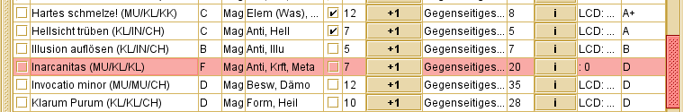

Custom Entry Plugin für die Helden-Software
===========================================

Dieses Plugin ist in der Lage, eigene Zauber, Talente, Sprachen, Sonderfertigkeiten 
und Repräsentationen zur DSA 4.1 Helden-Software von 
[www.helden-software.de](http://www.helden-software.de) hinzuzufügen.
Neue Zauber sind wahlweise per Editor oder zur regulären Aktivierung verfügbar, 
neue Talente werden über das "Erweiterungen"-Menü zu einzelnen Helden hinzugefügt.
Sonderfertigkeiten und Repräsentationen können über die üblichen Wege aktiviert werden.




Nach der Installation können eigene Zauber, Sonderfertigkeiten und Repräsentationen 
in eine Konfigurationsdatei eingetragen werden, und stehen dann in allen Helden 
zur Verfügung. Diese Konfigurationsdatei könnt ihr auch an andere Spieler versenden, 
denen eure Zauber dann ebenfalls zur Verfügung stehen.
 
Eigene Talente benötigen keine Konfiguration. 
 
 
 
Warnung
-------
*Bitte lest diesen Abschnitt genau, wenn ihr eure Helden nicht verlieren wollt!*

Die Helden-Software weigert sich Helden zu laden, die nicht bekannte Zauber/SF/Repräsentationen eingetragen haben. 
Daraus folgen einige Punkte, die man beachten sollte. 

**Helden mit eigenen Zaubern/SF/Repräsentationen können nur mit Plugin geladen werden.**
Wenn ihr die Helden-Software ohne Plugin startet, fehlen entsprechende Helden. 
Wenn ihr das Plugin nicht mehr nutzen wollt, müsst ihr alle eigenen Zauber/SF/Repräsentationen
vorher per Editor aus euren Helden entfernen. Für Talente gilt dies nicht.
 
**Helden können nur geladen werden, wenn alle eigenen Zauber/SF/Repräsentationen dem Plugin bekannt sind.**
Bevor ihr also einen Zauber/SF/Repräsentationen aus der Konfiguration löscht, muss der Zauber / die SF/Repräsentationen aus allen
Helden entfernt werden. Wenn ihr euren Helden exportiert und eurem Spielleiter schickt,
dann muss dieser das Plugin installiert haben, und alle eigenen Zauber/SF/Repräsentationen konfiguriert haben.
Talente werden im Held gespeichert, und funktionieren trotzdem.

**Wenn die Helden-Software meldet, dass manche eurer Helden nicht geladen werden konnten - Software schließen und nicht speichern!**
Sonst sind die betreffenden Helden weg. Endgültig. Es gibt drei mögliche Gründe, 
warum dieser Fehler auftreten kann: 
 - Plugin wurde nicht richtig installiert oder geladen. Lest die Installations-Anleitung nochmal. 
 - Ein Zauber / eine SF/Repräsentationen wurde aus der Konfiguration entfernt (oder umbenannt). Ein Spruch oder eine SF/Repräsentation den Helden aktiviert haben darf nicht entfernt oder umbenannt werden.
 - Die Helden-Software hat sich gerade aktualisiert und neugestartet. Ein weiterer Neustart (natürlich ohne zu speichern) löst das Problem. 

**Talente mit gleichem Namen sollten gleich sein.** Sonst weigert sich der Editor später, das Talent zu bearbeiten. 

**Macht Backups!**
Sollte eigentlich selbstverständlich sein, ist es aber leider nicht. 
Eure Helden liegen üblicherweise in eurem Benutzerverzeichnis (`C:\Benutzer\XXX\helden\helden.zip.hld` bzw. `~/helden/helden.zip.hld` unter Linux). 
Regelmäßiges Sichern dieser Datei kann euch viel Arbeit und viele Nerven sparen.
Außerdem ist es sinnvoll, die Konfiguration des Plugins gleich mitzusichern. 

**Keine Garantie.**
Dieses Plugin verwendet Schnittstellen, die nicht öffentlich dokumentiert sind, 
in einem Programm, dessen Quelltext dem Autor nicht vorliegt. Daher können 
ungewollte Nebenwirkungen nicht ganz ausgeschlossen werden (auch wenn bisher keine bekannt sind).
Aber da ihr ja alle Backups habt, sollte euch das nicht betreffen...


Installation
------------
Dieses Plugin kann *nicht* wie herkömmliche Helden-Software-Plugins installiert 
werden, da die offizielle Plugin-Schnittstelle nicht für solche Eingriffe gemacht ist.

Stattdessen muss dieses Plugin (die `CustomEntryLoader.jar`) die Datei sein, 
über die Ihr die Helden-Software startet. 

- Zuerst sucht Ihr den Ordner, in den die Helden-Software installiert ist. 
  Das ist der Ordner, in dem eine Datei namens `helden.jar` (oder `helden5.jar`) liegt. 
- Kopiert die `CustomEntryLoader.jar` in diesen Ordner
- Legt eine neue Verknüpfung zur `CustomEntryLoader.jar` an, und
  benutzt ausschließlich diese.
  
  Alternativ: Ändert eure Verknüpfungen ab (bspw. die im Startmenü, Rechtsklick -> Eigenschaften). 
  Ersetzt jedes Auftreten von `helden.jar` durch `CustomEntryLoader.jar`.

Solltet ihr die Helden-Software versehentlich über eine alte Verknüpfung starten
(ohne dass das Plugin geladen wird), werdet ihr mit einer großen Warnung begrüßt, 
dass manche eurer Helden nicht geladen werden können, und daher verloren gehen, 
sobald ihr erneut speichert. In diesem Fall: Keine Panik, schließen **ohne** zu
Speichern, und den Generator mit Plugin starten. 


Konfiguration
-------------
Neue **Zauber**, **Sonderfertigkeiten** und **Repräsentationen** werden nicht in der Helden-Software selber erstellt, sondern in eine
Konfigurationsdatei (`erweiterungen.json`) geschrieben. 
Diese Datei kommt ins gleiche Verzeichnis wie eure `helden.zip.hld` - also 
`C:\Benutzer\XXX\helden\erweiterungen.json` unter Windows bzw. `~/helden/erweiterungen.json` unter Linux.
Sollen mehrere Dateien geladen werden, können diese in einem Unterordner `erweiterungen` abgelegt werden (mit der Endung `.json`).
Bei Installation mit `-hslocal` (USB-Sticks etc.) können Erweiterungen auch neben die `helden.jar` gelegt werden. 
 
Neue **Talente** benötigen keine Konfiguration, und können im "Erweiterungen"-Menü erstellt werden.

### JSON-Dateien
Json-Dateien können mit einem beliebigen Texteditor angelegt oder bearbeitet werden
 (bspw. dem "Editor" von Windows). Die Datei sollte mit der Codierung "UTF-8" 
 gespeichert werden, sonst sind Umlaute später kaputt. Ein ordentlicher Editor 
 wie bspw. "Sublime Text" oder "Notepad++" kann das Leben einfacher machen, ist 
 aber nicht zwingend notwendig.

### Grundstruktur
Eine leere `erweiterungen.json` ohne neue Zauber, Sonderfertigkeiten und Repräsentationen sieht so aus: 
```
{
    "zauber": [
        // Hier kommen eure neuen Zauber hin 
    ],
    "sonderfertigkeiten": [
        // Hier kommen eure neuen Sonderfertigkeiten hin
    ],
    "repräsentationen": [
        // Hier kommen eure neuen Repräsentationen hin
    ]
}
```
Die `//` sind Kommentarzeichen - alles was dahinter steht gehört nicht zum 
 eigentlichen Inhalt der Datei (und wird nicht mit eingelesen). 
 
Ein einfacher Zauber sieht so aus: 
```
{
    "zauber": [
        {
            "name": "Bannbaladin (erhöhte Reichweite)",
            "kategorie": "B",
            "merkmale": ["Einfluss"],
            "probe": "IN/CH/CH",
            "settings": ["Aventurien"]
        }
    ]
}
```

### Zauber konfigurieren
Der folgende Zauber verwendet alle möglichen Optionen:
```
{
    "zauber": [
        // === Inarcanitas - ein neuer Zauber aus unserer Runde ===
        {
            "name": "Inarcanitas", // Zaubername, darf noch nicht existieren
            "kategorie": "F", // A-H
            "merkmale": ["Anti", "Kraft", "Metamagie"], // Kurzfassung und Langfassung möglich
            "probe": "MU/KL/KL", // Probe "XX/YY/ZZ", auch "**" möglich
            "mod": "+Mod", // (optional) "+MR", "+Mod", ...
            "quelle": "LCD:123", // (optional) Format muss "XXX:<seitenzahl>" sein

            // Settings (optional)
            // In welchem Regel-System kommt der Spruch vor?
            // Die Auswahl eines / mehrerer Settings erlaubt es, den Spruch im Editor zu aktivieren
            // Mögliche Werte: "Alle", "DSA4.1"/"Aventurien", "Myranor", "Tharun", ...
            "settings": ["Aventurien"],

            // Verbreitungen (optional)
            // In welcher Repräsentation existiert der Spruch, wie häufig (0-7)?
            // Setting + Verbreitung erlaubt es, den Spruch regulär zu aktivieren
            "verbreitung": {
                "Mag": 7,
                "Elf": 4,
                "Hex(Mag)": 2  // Hexen können den Spruch in gildenmagischer Repräsentation lernen
            },
            // An dieser Stelle keine eigenen Repräsentationen eintragen.

            // Spezialisierungen (optional)
            // Mögliche Zauberspezialisierungen (spontane Modifikationen, Varianten, ...)
            "spezialisierungen": [
                "Reichweite",
                "Zauberdauer",
                "Variante X"
            ]
        }
    ]
}
```
Zur Sichtbarkeit eines Zaubers gilt:
- Ist ein Setting gesetzt, kann der Zauber per Editor hinzugefügt werden
- Ist ein Setting und eine Verbreitung gesetzt, kann der Zauber (in diesen 
  Repräsentationen) aktiviert werden
- Wenn kein Setting gesetzt ist, kann der Zauber nicht hinzugefügt werden 
  (aber weiter gesteigert werden, wenn er schon aktiviert ist).


### Weitere Beispiel-Zauber
Die komplette Beispiel-Datei gibt's hier: [examples.json](src/main/resources/examples/examples.json)
```
{
    "zauber": [
        // === Kurzfassung - Bannbaladin aus der Zauberwerkstatt ===
        {
            "name": "Bannbaladin (erhöhte Reichweite)",
            "kategorie": "B",
            "merkmale": ["Einfluss"],
            "probe": "IN/CH/CH",
            "mod": "+MR",
            "settings": ["Aventurien"],
            "verbreitung": { "Mag": 2 },
            "spezialisierungen": ["Reichweite", "Wirkungsdauer", "Zauberdauer", "Zielobjekt"]
        },

        // === Nur für Meisterpersonen ===
        {
            "name": "Armageddon Weltenbrand",
            "kategorie": "G",
            "merkmale": ["Elementar (Feuer)", "Umwelt"],
            "probe": "MU/KL/KO",
            "settings": ["Aventurien"]
            // Keine Verbreitung - nur per Editor wählbar
        }
    ]
}
```


### CSV für Zauber

Da viele Tabellenkalkulationen den Export nach CSV ermöglichen und dies für viele Anwender dies einfacher zu handhaben ist, besteht die Option neue Zauber auch über eine `erweiterungen.csv`-Datei zu importieren.
Die Konfiguration ist wie bei json zu handhaben:
Die `erweiterungen.csv` Datei, kommt ins gleiche Verzeichnis wie eure `helden.zip.hld`, als `C:\Benutzer\XXX\helden\erweiterungen.csv` unter Windows bzw. `~/helden/erweiterungen.csv` unter Linux.

Die folgende Tabelle veranschaulicht das Format:

```
Name,Kategorie,Merkmale,Probe,Mods/MR,Verbreitung,Settings
Mein Zauber,D,Antimagie,MU/KL/CH,,Mag3,Aventurien

```

Beispieldateien liegen dem Plugin bei (für Excel und Libreoffice). 


### Neue Sonderfertigkeiten
Sonderfertigkeiten werden wie folgt konfiguriert:
```
{
    "sonderfertigkeiten": [
        {"name": "Gesegnet", "kosten":  200},
        {"name": "Feenwelten-kundig", "kosten":  200, "kategorie":  "Geländekunde"}
    ]
}
```
Der Name darf nicht verändert werden, sobald die Sonderfertigkeit bei einem Held aktiviert wurde. 
Gültige Kategorien sind: `"Allgemein", "Geländekunde", "Kampf: Nahkampf", "Kampf: Fernkampf", "Magisch", "Magisch: Repräsentation", "Magisch: Merkmalskenntnis", "Magisch: Objektritual", "Elfenlied", "Kampf: Manöver", "Geweiht: Liturgie", "Geweiht", "Magisch: Schamanenritual", "Magisch: Magische Lieder"`.

Eine eigene Ritualkenntnis oder Liturgiekenntnis kann ebenfalls über Sonderfertigkeiten realisiert werden. 
Bei Aktivierung einer solchen Sonderfertigkeit wird automatisch ein passender Talentwert angelegt und aktiviert.
Die Konfiguration sollte so aussehen:
```
{
    "sonderfertigkeiten": [
        {"name": "Ritualkenntnis: Alt-Druidisch", "kosten":  250, "kategorie":  "Magisch"},
        {"name": "Liturgiekenntnis (Rastullah)", "kosten":  0, "kategorie":  "Geweiht"}
    ]
}
```

Zu Sonderfertigkeiten können Vorbedingungen hinzugefügt werden. 
Nur Helden, die diese Bedingungen erfüllen können die Sonderfertigkeit erlernen.
Es müssen immer alle Bedingungen erfüllt werden, mögliche Bedingungen sind `Eigenschaft`, `Talent`, `Zauber`, `Sonderfertigkeit`, `LKW` und `MagieLevel`.
```
{
    "sonderfertigkeiten": [
        {"name": "Kristall-Stab", "kosten":  750, "kategorie":  "Objektritual", "bedingungen": [
            {"type": "Sonderfertigkeit", "name": "Ritualkenntnis: Kristallomantie"},  // Sonderfertigkeit muss aktiviert sein (eigene SF möglich)
            {"type": "Zauber", "name": "Hartes schmelze!", "value": 10},  // ZfW "Hartes schmelze!" >= 10 (eigene Zauber möglich)
            {"type": "Talent", "name": "Steinschneider/Juwelier", "value": 10},  // TaW Steinschneider >= 10 (eigene Talente nicht möglich)
            {"type": "Eigenschaft", "name": "FF", "value": 15},  // Fingerfertigkeit >= 15
            {"type": "LKW", "value": 3},  // Liturgiekenntnis >= 3
            {"type": "MagieLevel", "name": "Geweihter"}  // Optionen: "Viertelzauberer", "Spruchzauberer", "Schamane", "Halbzauberer", "Vollzauberer", "Geweihter"
        ]}
    ]
}
```
Komplexere Bedingungen können mit dem Typ `or` erstellt werden. Aus der Liste von `or`-Bedingungen muss nur eine erfüllt werden.
```
{
    "sonderfertigkeiten": [
        {"name": "Liturgie: X", "kosten":  50, "kategorie": "Liturgie", "bedingungen": [
            {"type": "MagieLevel", "name": "Geweihter"},
            {"type": "LKW", "value": 3},  // Liturgiekenntnis >= 3
            {"type": "or", "bedingungen": [  // Held muss entweder Praios- oder Rondrageweihter sein
                {"type": "Sonderfertigkeit", "name": "Liturgiekenntnis (Praios)"},
                {"type": "Sonderfertigkeit", "name": "Liturgiekenntnis (Rondra)"}
            ]}
        ]}
    ]
}
```
Bei magischen Sonderfertigkeiten entscheidet sich an den Bedingungen, ob eine Verbilligung durch "Akademische Ausbildung (Magier)" zum Tragen kommt.
Generell verbilligt die Ausbildung alle irgendwie magischen Sonderfertigkeiten, die entweder eine Bedingung Gildenmagie (Repr oder RK) haben, oder gar keine Ritualkenntnis zur Bedingung haben.
Soll eine eigene magische Sonderfertigkeit für Magier also nicht verbilligt sein, muss zwangsläufig eine andere Ritualkenntnis zur Bedingung gemacht werden.


### Neue Repräsentationen
Neue Repräsentationen werden wie folgt konfiguriert:
```
{
    "repräsentationen": [
        {
            "name":  "Hochelfisch",
            "abkürzung": "Hoc",
            "ritualkenntnis":  true,   // true oder false - ob eine Ritualkenntnis existiert
            "zauber": {   // Verbreitung der in dieser Repräsentation bekannten Zauber
                "Armatrutz":  7,   // Format: "Zaubername": Verbreitung (1-7)
                "Fulminictus Donnerkeil":  7
            }
        }
    ]
}
```
Name und Abkürzung dürfen nicht verändert werden, sobald die Repräsentation oder ein Zauber in dieser Repräsentation aktiviert wurden.
Eigene Zauber können hier verwendet werden.


Entwickler
----------
### Wie funktioniert's?
Die Helden-Software nutzt (aus urheberrechtlichen Gründen) *Obfuscation-Techniken*, 
 um ihren Quellcode geheim zu halten. Dieses Plugin verwendet daher Java's 
 *Reflection-API*, um mit den internen, unkenntlich gemachten Klassen der 
 Helden-Software zu interagieren.
  
Wer seine Java-Kenntnisse vertiefen möchte - die Magie steckt in der Klasse 
 [EntryCreator](src/main/java/de/mb/heldensoftware/customentries/EntryCreator.java).

### Plugin compilieren
Das Plugin nutzt [Maven](https://maven.apache.org/) für seinen Build-Prozess. 
 Gängige Entwicklungsumgebungen erkennen Maven-Projekte reibungslos. 
 Mit dem Befehl `mvn package` wird die Jar erzeugt. 

Bevor das Projekt compiliert werden kann, muss ein Ordner `heldensoftware` 
 im Hauptverzeichnis angelegt werden, und die `helden.jar` hineinkopiert werden. 
 Alternativ funktioniert auch ein Linux-Symlink ins Installationsverzeichnis (namens `heldensoftware`):
 `ln -s <pfad zu ordner mit helden.jar> heldensoftware`
 
 
 
Externe Komponenten
-------------------
Dieses Plugin basiert auf verschiedenen anderen Projekten:

- json-simple by *Yidong Fang*, [Apache License 2.0](http://www.apache.org/licenses/LICENSE-2.0)
- [OpenPojo](https://github.com/oshoukry/openpojo), [Apache License 2.0](http://www.apache.org/licenses/LICENSE-2.0)
- IntelliJ Forms_rt by [Jetbrains](http://www.jetbrains.com/), [Apache License 2.0](http://www.apache.org/licenses/LICENSE-2.0)
- [ASM Commons](http://asm.ow2.org/), [Apache License 2.0](http://www.apache.org/licenses/LICENSE-2.0)
- [Apache CSV](https://commons.apache.org/proper/commons-csv/), [Apache License 2.0](http://www.apache.org/licenses/LICENSE-2.0) 
 
 
 
Kontakt
-------
 - "Rothen" bei [dsaforum.de](http://dsaforum.de/memberlist.php?mode=viewprofile&u=12050) | [Thread](https://dsaforum.de/viewtopic.php?f=9&t=44850)
 - Per Mail: markus-7y5wrhdz (AT) mk-bauer.de
 - Github: [MarkusBauer/helden-software-loader](https://github.com/MarkusBauer/helden-software-loader)
